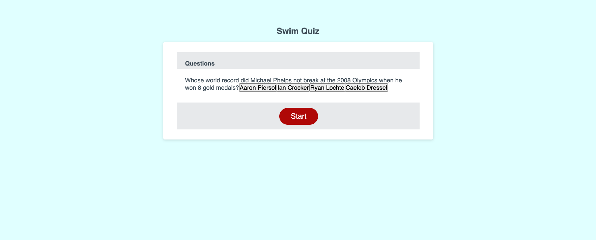

# homework-4

Our task was to build a quiz with javascript that incorporates a timer for answering questions, keeps score, and allows input for a high score table. 

I got a timer from a reference in Slack, but I never got it to work, so it's commented out in the script. 

I set up questions, possible answers, and correct answers in an array. 

The questions I made up off the top of my head, and the answers are accurate. 

The html and css is a modified version of the code from the homework 3. 

There were several students working in zoom groups I hosted that were working on and sharing code, but I don't think I copied anything from them. Any similaririties would be incidental. 

I worked with Ethan Cho extensively on what code I have. I never saw his, so any similarities are from his tutoring me. It was at his advice I stopped working on this project to go back and drill some basics while turning in what I have, which is maybe the best advice I've gotten since bootcamp started. 

https://bmalbright.github.io/homework-4/

